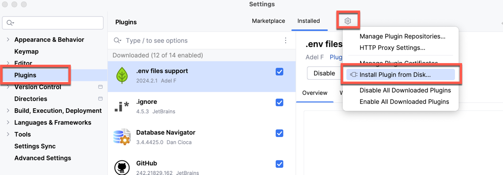

# PNG Image Replacer Plugin

A simple Intellij Plugin that makes it easy to replace the content of existing PNG image files. 

## Usage 

Use the right-click **Refactor -> Replace with Clipboard Image** popup menu option, either from the
project tree or by right-clicking an image.


The plugin will prompt for confirmation and then overwrite the selected file with whatever image is in the 
clipboard. If this is a multi-resolution image the plugin will use the image with the highest resolution.


## Installation

Install either from the Intellij Marketplace or clone this repo and build with

```
./gradlew buildPlugin
```

If all goes well the plugin jar will be in the `build/libs` folder.

Install this jar using the "Install Plugin from Disk." option in the Intellij Plugin Settings:




## Why?

I created this as I am frequently updating screenshots in documentation projects. And I'm lazy.

Feel free to open issues/PRs, etc.

Have fun!