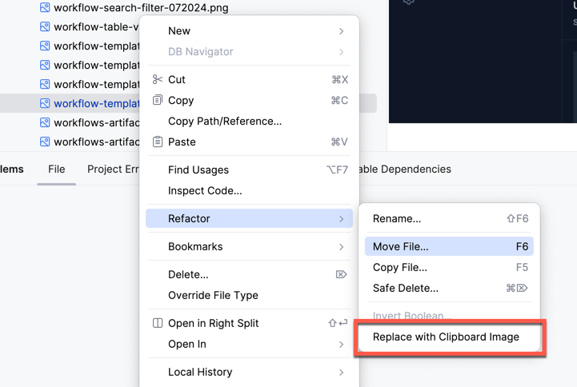

# PNG Image Replacer Plugin

A simple Intellij Plugin that makes it easy to replace the content of existing PNG image files.

Use the right-click Refactor -> Replace with Clipboard Image popup menu option, either from the
project tree or by right-clicking an image.

If there is a multi-resolution image in the clipboard the plugin will use the image with the highest resolution.

Have fun!